# PROYECTO Y DESCRIPCIÓN
Una aplicación intuitiva desarrollada en Python con la librería Tkinter que guía al usuario en la creacíon, evaluación, guardado y uso de modelos de regresión lineal utilizando scikit-learn. Ideal para cualquier persona que quiera aplicar regresión lineal sin escribir código.

# Propósito
Desarrollar una app que permita crear y visualizar modelos de regresión lineal simple [y múltiple] a partir de datos almacenados en archivos csv, excel, y bases de datos (SQLite), y hacer predicciones con ellos.

# Estructura
- `src/`: Código fuente.
- `files/`: Archivos para la ejecución.
- `docs/`: Documentación.
- `tests/`: Tests de pruebas.
- `images/`: Imágenes para el manual de usuario.

# Características principales
- **Carga de datos**: Soporte para archivos CSV y Excel.
- **Previsualización** de los datos en una tabla.
- **Selección sencilla** de variables predictoras y variables objetivo.
- **Preprocesamiento** de valores faltantes (eliminar filas, rellenar con media o valor constante).
- **División automática** en conjuntos de entrenamiento y prueba (con control de porcentaje y semilla).
- **Entrenamiento** de modelo de Regresión Lineal.
- **Evaluación** con métricas (R² y Error Cuadrático Medio) en entrenamiento y prueba.
- **Visualización**:
  - Gráfico de ajuste.
  - Gráfico Real vs Predicho.
- **Fórmula legible** del modelo entrenado.
- **Descripción opcional** del modelo.
- **Guardado y carga** de modelos completos (incluye fórmula, métricas y descripción).
- **Predicción interactiva** con el modelo entrenado o cargado.

# Requisitos

- Python 3.8 o superior
- Librerías:
  - `pandas`
  - `numpy`
  - `scikit-learn`
  - `matplotlib`
  - `joblib`
  - `openpyxl` (para soporte Excel)

# Nota:
 La aplicación utiliza Tkinter, que viene incluido con la mayoría de instalaciones de Python. En algunas distribuciones de Linux, puede ser necesario instalarlo manualmente.

# Instrucciones de instalación y uso 

Instalación:
    Paso 1: Descarga el proyecto
    Puedes hacerlo bien clonando el repositorio con git o bien descargando el ZIP desde GitHub y descomprimirlo.
    Paso 2: Crea un entorno virtual (para evitar conflictos con otras instalaciones de python).
    Paso 3: Instala las dependencias (especificadas anteriormente).
Ejecución:
 Para ejecutar la aplicación simplemente en tu editor de python ejecuta el archivo main.py.
 
 Posteriormente se iniciará la aplicación y aparecerá una pantalla de bienvenida donde puedes cargar un modelo ya existente (Paso 0), en caso de hacer clic en siguiente accedes a la pantalla de carga de datos, donde debes seleccionar un archivo CSV o .xlsx (Paso 1).A continuación accedes a la pantalla de configuración y preprocesamiento, donde debes seleccionar una o múltiples variables predictoras y una sola objetivo, a su vez realizas la limpieza de valores faltantes ajustar el tamaño del conjunto de prueba y aplicar la configuración(Paso 2). El siguiente paso es la creación del modelo, que una vez creado verás la fórmula del modelo, las métricas, los gráficos, el panel de predicción, la descripción (opcional) y guardar modelo (Paso 4).

# Notas Técnicas para Desarrolladores y Colaboradores

Este documento está dirigido a desarrolladores que quieran entender, mantener, extender o contribuir al proyecto.

La aplicación es una GUI de escritorio monolítica escrita en Python utilizando:

- **Tkinter** como framework de interfaz gráfica.
- **Pandas** para manejo de datos.
- **scikit-learn** para el modelo de Regresión Lineal y métricas.
- **Matplotlib** integrado en Tkinter.
- **joblib** para serialización de modelos.

No se utilizan frameworks externos complejos, lo que facilita su mantenimiento y ejecución sin compilación.

Para más información sobre la contribución al proyecto leer documento "CONTRIBUTING.md"

# Manual de usuario 

A continuación se explican  las distintas funcionalidades
implementadas junto con capturas de pantalla.

## 1. Carga de datos
**Escenario positivo:**  
- Cargar archivos CSV, Excel o SQLite válidos.  
- Los datos se cargan correctamente y se muestra mensaje de éxito.  
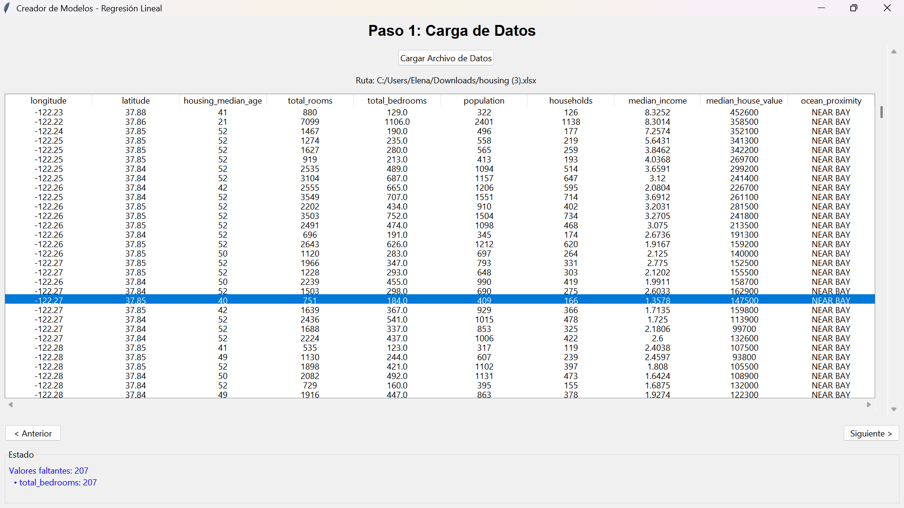  

**Escenario negativo:**  
- Cualquier otro tipo de archivo no es mostrado al usuario.  
- No se produce error, simplemente no se permite cargar el archivo.  

## 2. Selección de columnas
**Escenario positivo:**  
- Seleccionar columnas de entrada (features) y salida (target).  
- Se muestra mensaje: “Datos son procesados y divididos. Puedes avanzar”.  
- Si se seleccionan varias columnas de entrada funciona igual que con una sola.  
- Una vez seleccionadas, las columnas target no se pueden quitar.  
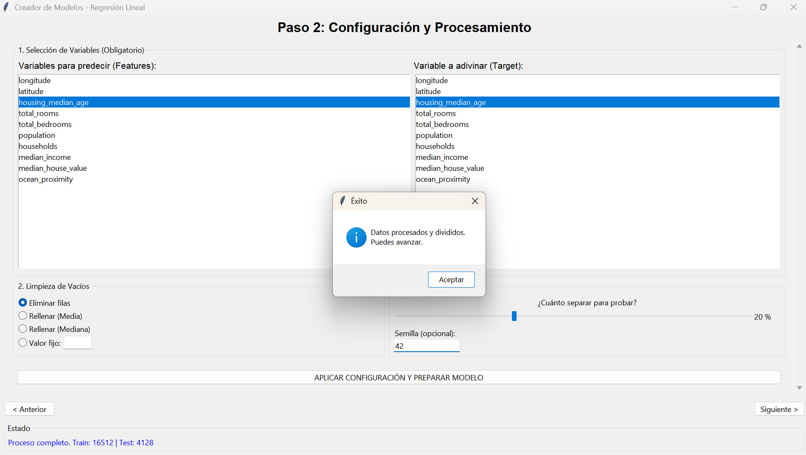
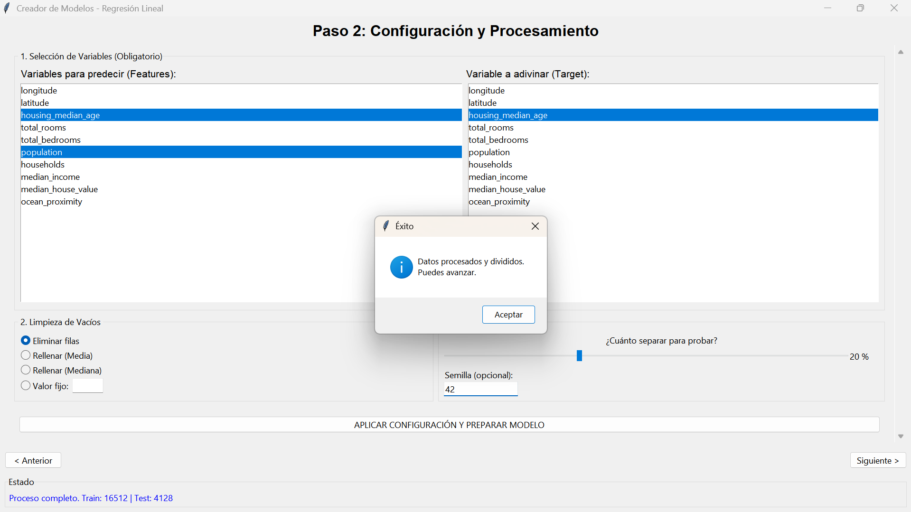

**Escenario negativo:**  
- No seleccionar columnas de entrada ni de salida.  
- Mensaje de error: “Por favor selecciona features y target”.  
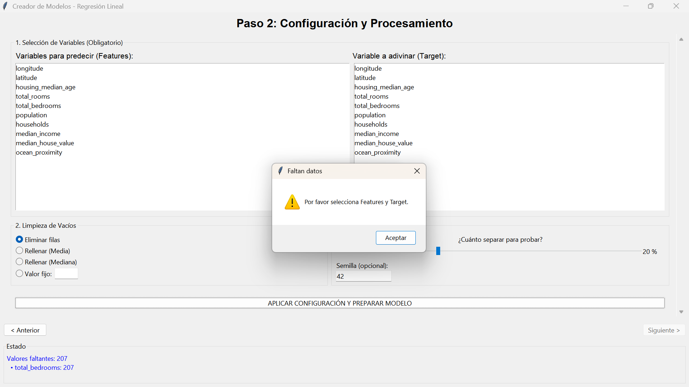
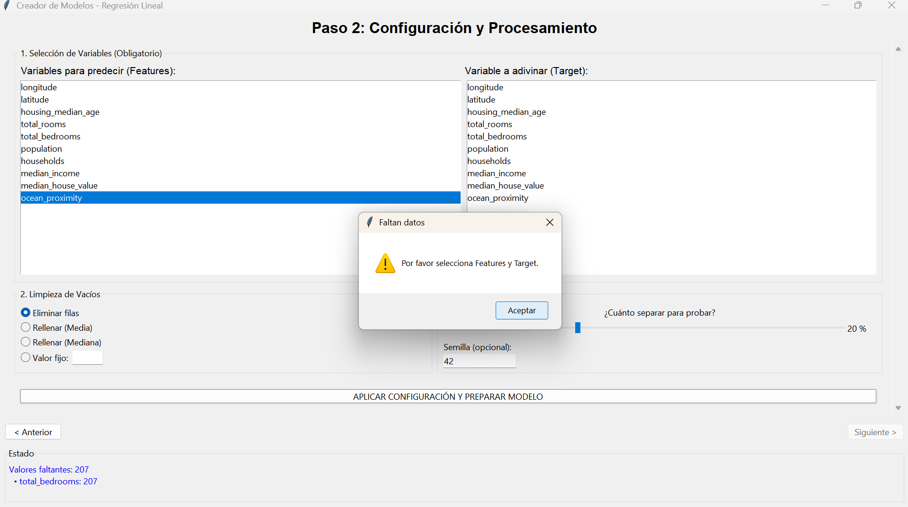
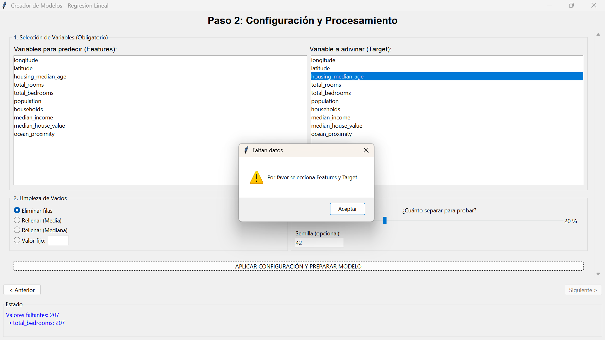

## 3. Preprocesado de datos

**Escenarios positivos:**  
- **Eliminar filas con valores faltantes:** Datos limpios, mensaje de éxito.  
- **Rellenar con media:** Si la columna es numérica, se reemplazan valores faltantes por la media.  
- **Rellenar con valor constante:** Los valores se reemplazan correctamente.  
- **Rellenar con mediana (opcional a añadir):** Reemplaza valores faltantes con la mediana de la columna.  
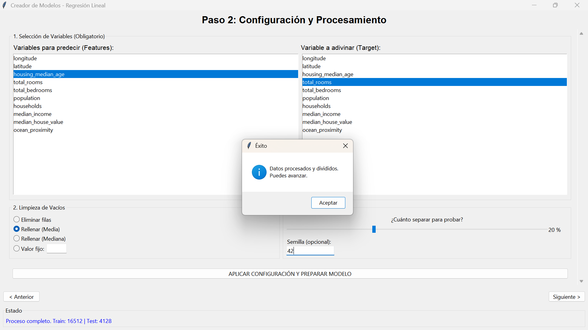

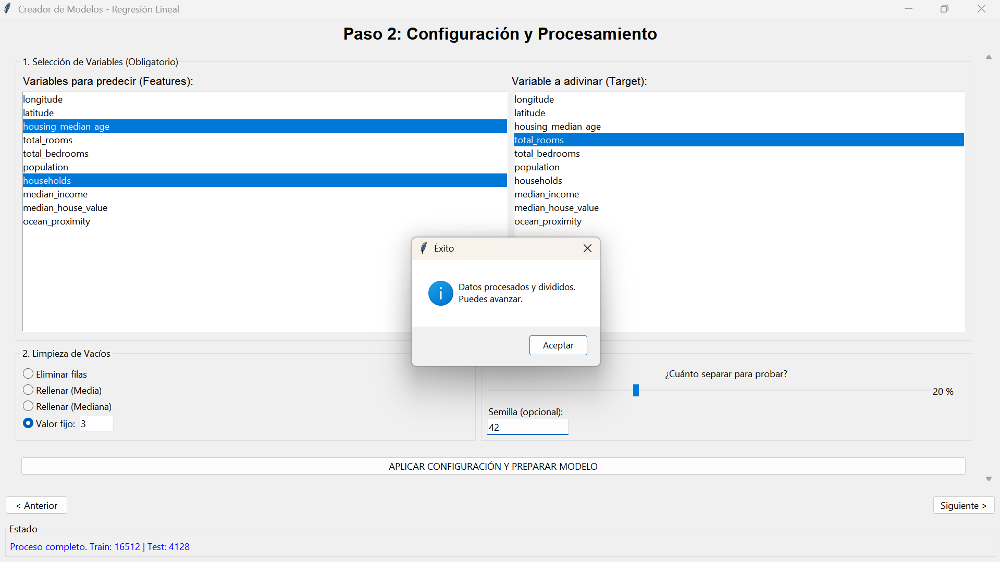

**Escenario negativo:**  
- Rellenar con un valor no numérico en columna numérica.  
- Mensaje de error: `error en limpieza: could not convert string to float: ''`.  
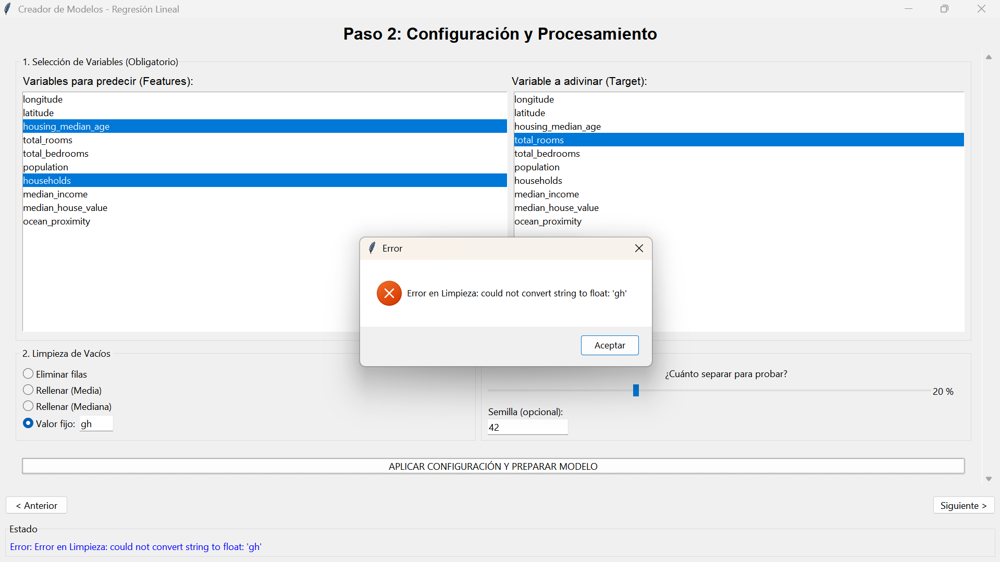

## 4. División de datos
**Escenario positivo:**  
- Split 20% de froma predeterminada test aplicado correctamente, mensaje de éxito.  

**Escenarios negativos:**  
- Si preprocesado eliminó casi todas las filas: “Error en División: Datos insuficientes tras la limpieza”.  
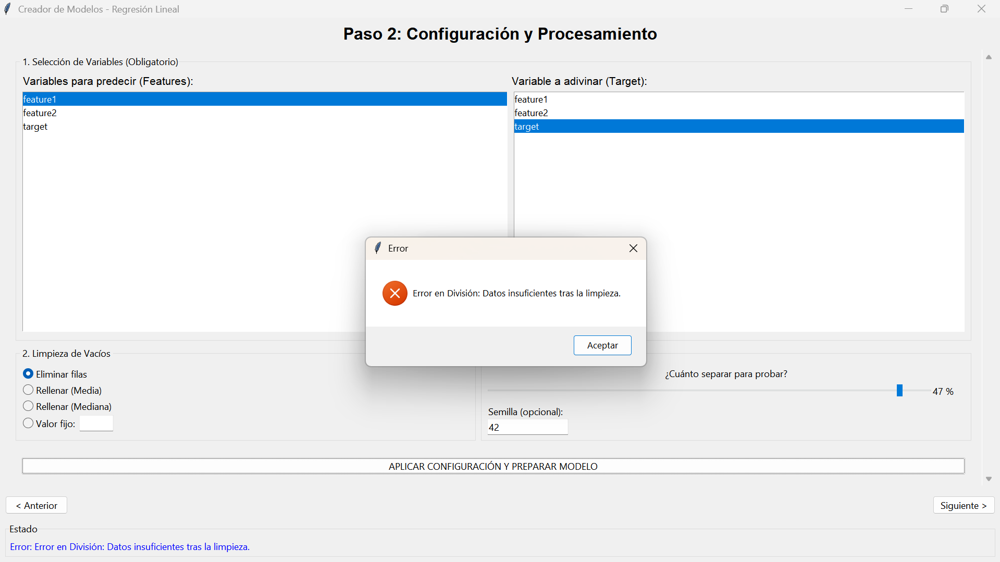

## 5. Creación del modelo
**Escenario positivo:**  
- Crear modelo con datos válidos.  
- Se muestran: modelo entrenado, fórmula, métricas y gráfico.  
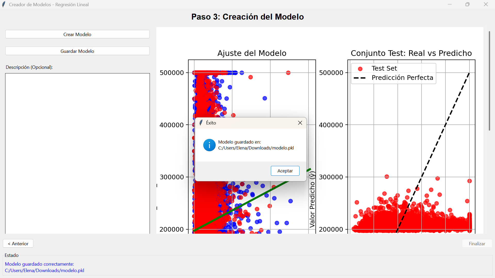

**Escenario negativo:**  
- Intentar crear modelo sin dividir los datos:  
  Mensaje: “Primero, debe dividir los datos en conjuntos de entrenamiento y test”.  
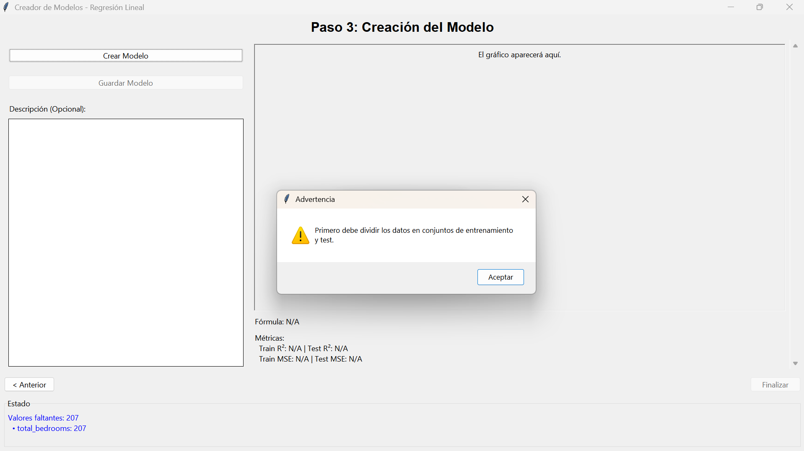

## 6. Predicción
**Escenarios positivos:**  
- Ingresar valores numéricos en todas las features → predicción correcta.  
- No se puede predecir antes de cargar datos → botón deshabilitado.  
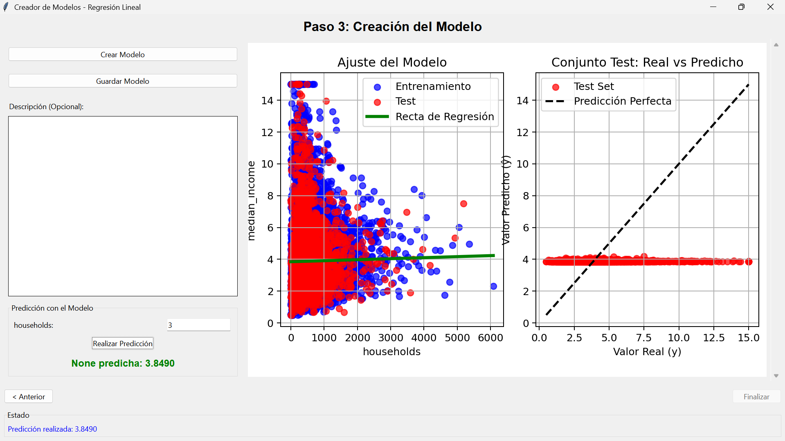

**Escenario negativo:**  
- Ingresar texto en lugar de número → mensaje de error, no se realiza la predicción.  
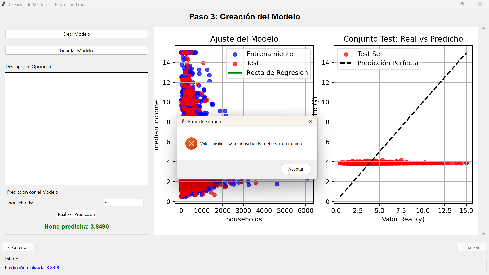

## 7. Guardado y carga de modelo
**Escenario positivo:**  
- Guardar modelo → archivo creado y mensaje de éxito.  
- Cargar modelo `.pkl` válido → features y target actualizados, predicción habilitada.  

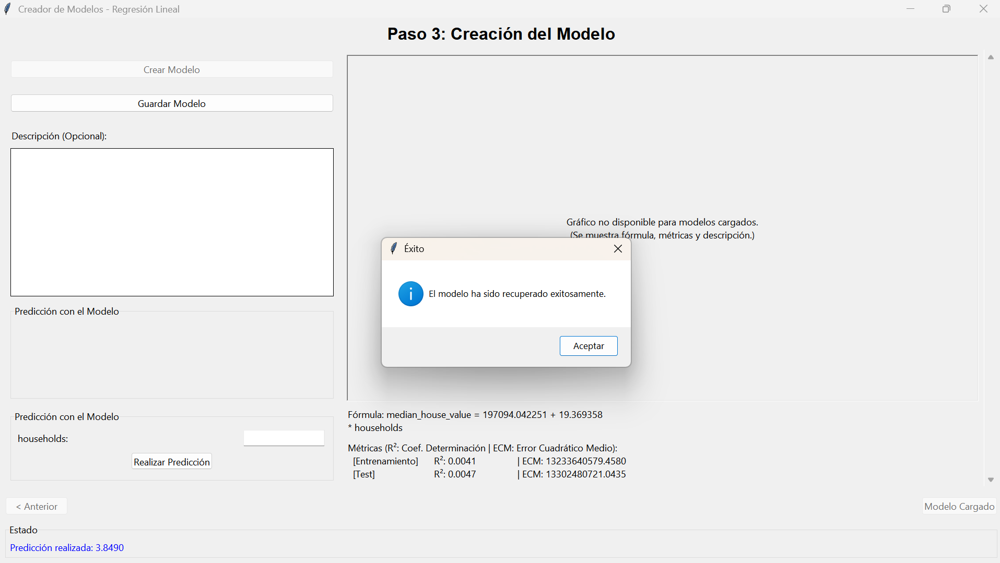

**Escenario negativo:**  
- Cargar archivo corrupto o vacío → mensaje de error.  
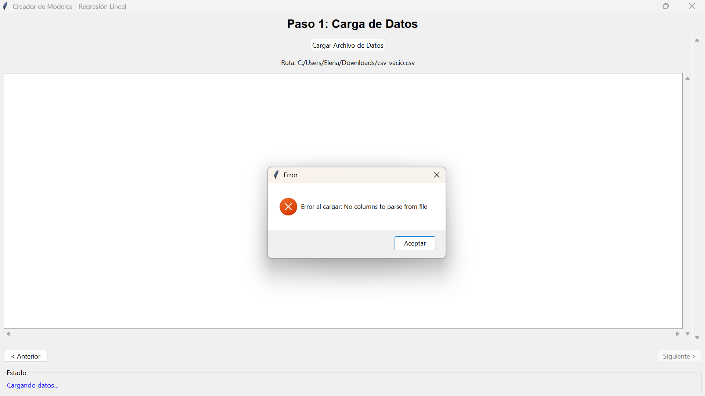

## 8. Manejo de errores generales
- Botón “Siguiente” deshabilitado si no se ha cargado un archivo → evita errores de flujo.  
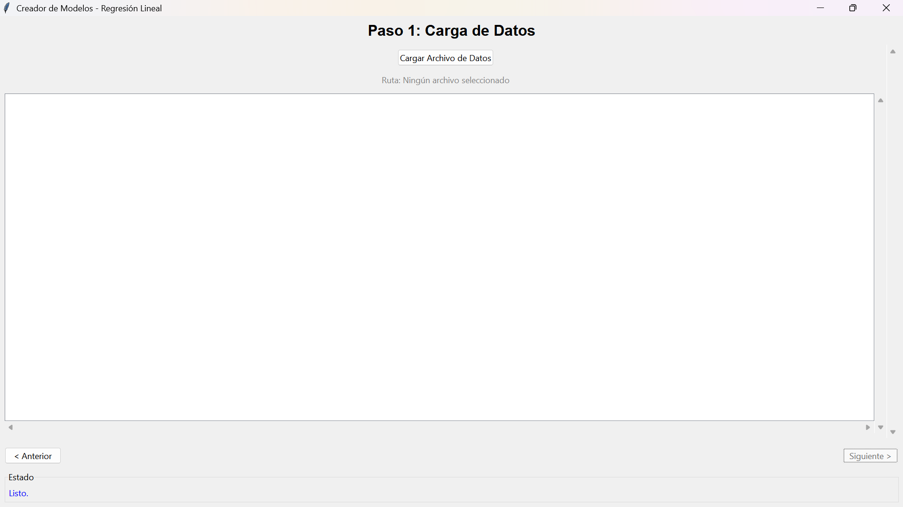

